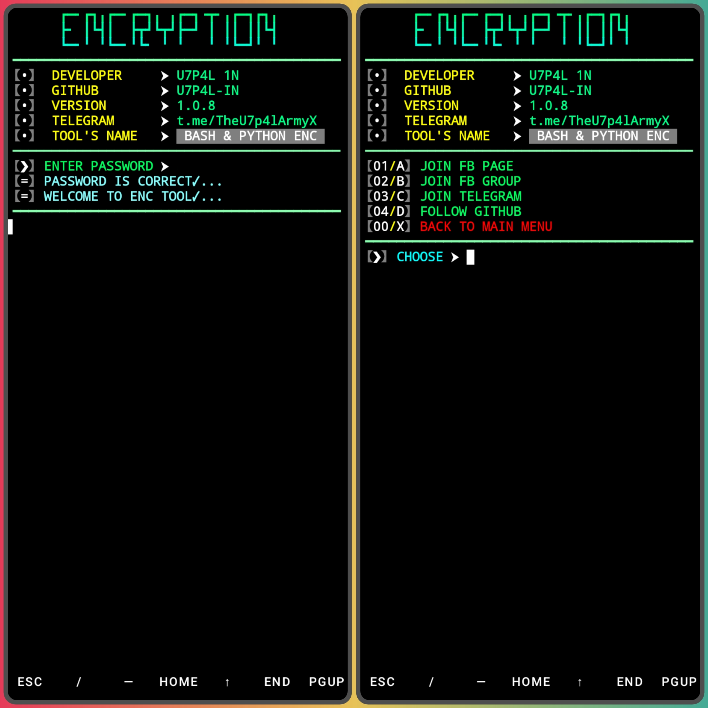
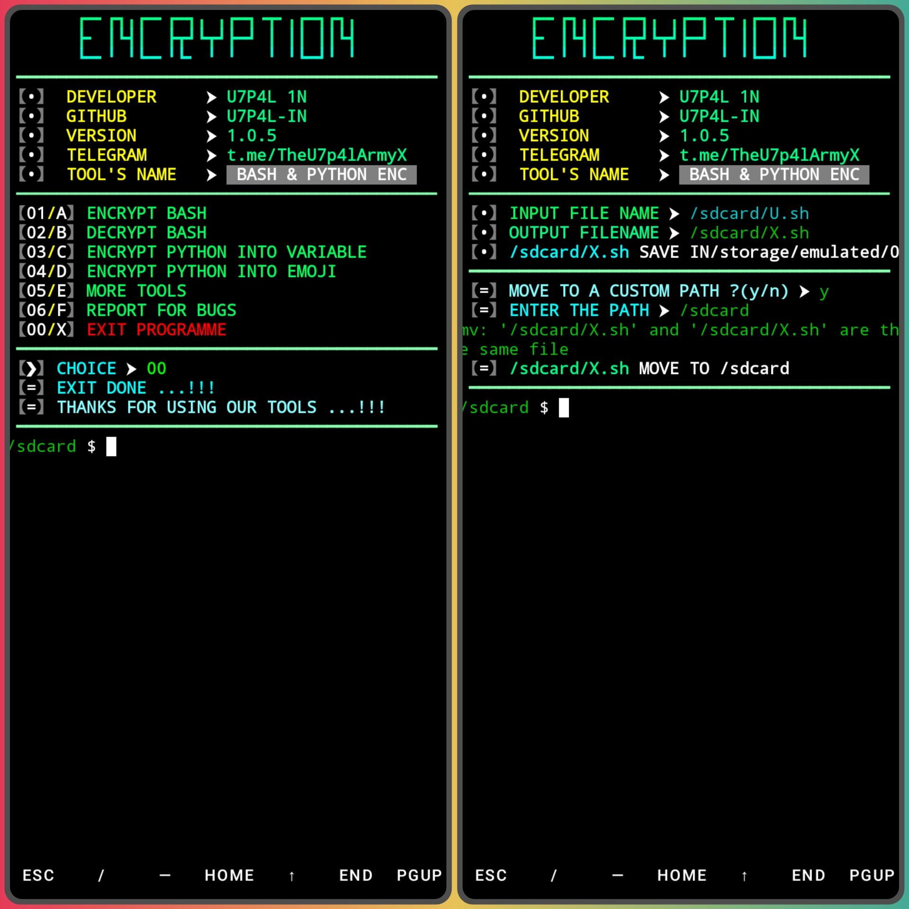

</p>
   <p align="center">
      <a href="https://github.com/U7P4L-IN/ENC/stargazers">
      </a>
      <a href="https://github.com/U7P4L-IN/ENC/releases/latest">
      </a>
      <a href="https://www.conventionalcommits.org/en/v1.0.0/">
      </a>
      <a href="https://github.com/U7P4L-IN/ENC/actions/workflows/github-action.yml">
      </a>
   </p>
   
<p align="center">

Encrypt/decrypt shell script and compile python script into variable or emoji

</p>

## FETURE - 
- BASH FILE ENCRYPTION AND DECRYPTION 
- PYTHON TO VARIABLES ENCRYPTION
- PYTHON TO EMOJI ENCRYPTION

## Language</br>

<p align="center"> 

 </div>
 
#### INSTALL TOOL ON TERMUX
```python
apt update && apt upgrade -y
pkg install git
pkg install python
pip install requests
rm -rf ENC
git clone --depth=1 https://github.com/U7P4L-IN/ENC.git
cd ENC
python ENC.py
```
### Screenshots:

<p align="center">
<p align="center">


<p align="center">  <a href="https://t.me/AN0NYM0U5_X"></a></p>
 
## NOTE - 
- You See Any Error Of This Command.So,Frist Run Termux Setup Command

### Languages :

<p align="center">
</p>

### Contributing
>Feel Free To Clone This Project. For Major Changes, Please Open An Issue First To Discuss What You Would Like To Change Or Add, Thank You!!.

<h2 align="center">LICENSE</h2>

**BASH/PY ENC** Tools is released under the MIT license, which grants the following permissions:
- Commercial use
- Modification
- Distribution
- Patent use
- Private use

For more convoluted language, see the [LICENSE](/LICENSE).
</br>

<h5 align="center"><b>DESCRIPTION</b></h5>

* ©️ Copyright Message
>> Copyright © [2023-27] [U7P4L-IN]
>All rights reserved. This Python project, along with its code, documentation, and any associated files, is the intellectual property of ANONYMOUS CYBER. You may not reproduce, distribute, or modify the contents of this repository without explicit permission from the owner.
# Give A Star ⭐
> You can also give this repository a star to show more people and they can use this repository.